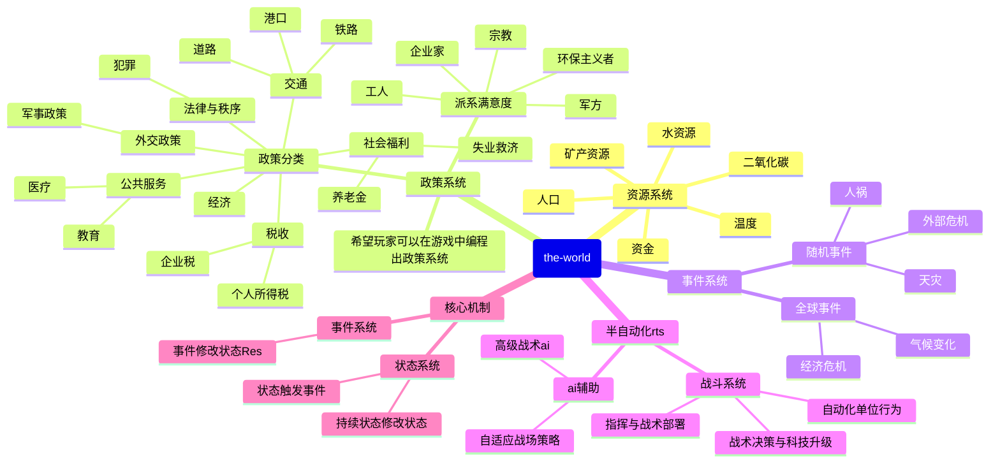

# the world

A war-chess game depicting the world.

## 背景故事（突发奇想）

在某一年，特朗普再次当选美国总统，比特币开始暴涨，发现这个的你想到要是能回到比特币最便宜的那天就好了，于是你造了一个时光机，但是时光机出现故障，你被传送到了史前时代，当你走出坏掉的时光机，这个世界上的史前人类开始祭拜你。。。。。。

## 主要开发教程

https://bevyengine.org/learn/quick-start/getting-started/setup/#enable-fast-compiles-optional

## 思维导图（暂定）

