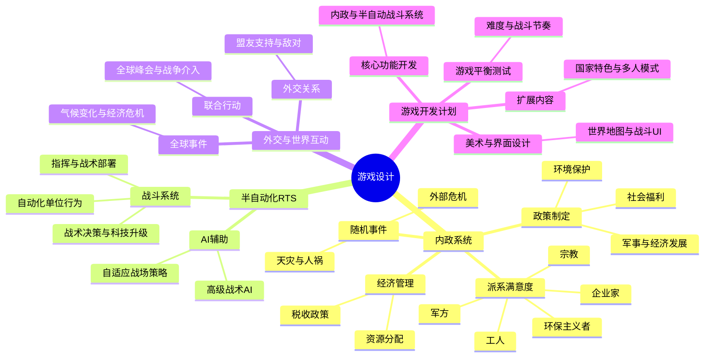

# the world

A war-chess game depicting the world.

## 思维导图（暂定）



## 项目结构(暂定)

``` project structure
the-world/
├── src/                      # 源代码目录
│   ├── main.rs               # 游戏入口文件
│   ├── systems/              # 核心系统模块
│   │   ├── board.rs          # 棋盘系统（地图、单位布局等）
│   │   ├── units.rs          # 单位系统（单位属性、行为等）
│   │   ├── combat.rs         # 战斗系统（自走棋逻辑、战斗回合等）
│   │   ├── ai.rs             # AI 系统（敌人行为逻辑）
│   │   ├── player.rs         # 玩家模块（玩家状态与输入处理）
│   │   ├── turns.rs          # 回合管理模块
│   │   └── events.rs         # 游戏事件系统（如技能、伤害事件等）
│   │
│   ├── ui/                   # 用户界面相关代码
│   │   ├── menu.rs           # 主菜单 UI
│   │   ├── hud.rs            # 游戏内 HUD 界面
│   │   └── overlays.rs       # 游戏内叠加界面（例如暂停菜单）
│   │
│   ├── assets/               # 资源加载模块
│   │   └── config.rs         # 游戏配置（技能、单位数据等配置文件的读取）
│   │
│   ├── game_state.rs         # 游戏状态管理（管理游戏进程、胜负等）
│   └── lib.rs                # 游戏库入口，公共导出模块
│
├── assets/                   # 静态资源文件（引擎和游戏共用）
│   ├── textures/             # 图像文件（如棋盘、单位贴图）
│   ├── sounds/               # 音效文件
│   ├── configs/              # 配置文件（如技能表、单位表）
│   └── levels/               # 地图数据
│
├── tests/                    # 测试目录
│   ├── integration_test.rs   # 集成测试
│   └── unit_test.rs          # 单元测试
│
├── docs/                     # 文档目录
│   ├── README.md             # 项目概述
│   ├── DESIGN.md             # 设计文档
│   ├── GAME_RULES.md         # 游戏规则说明
│   ├── ROADMAP.md            # 功能规划
│   └── CONTRIBUTING.md       # 贡献指南
│
├── Cargo.toml                # Rust 配置文件，包含依赖
├── Cargo.lock                # 锁定依赖版本
└── README.md                 # 项目简介文件
```
