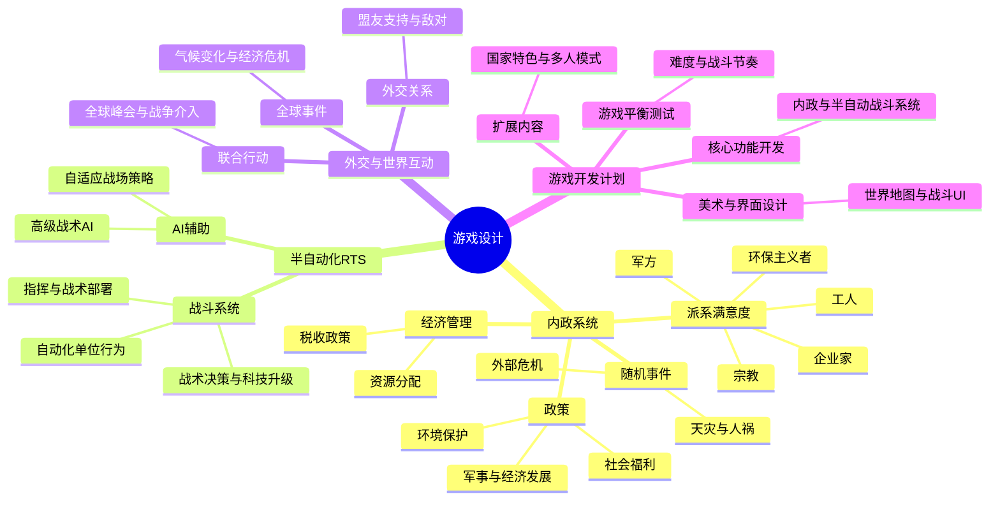

# 初稿

```mermaid
mindmap
  root((游戏设计))
    内政系统
      经济管理
        税收政策
        资源分配
      政策
        社会福利
        环境保护
        军事与经济发展
      派系满意度
        军方
        企业家
        工人
        宗教
        环保主义者
      随机事件
        天灾与人祸
        外部危机
    半自动化RTS
      战斗系统
        自动化单位行为
        指挥与战术部署
        战术决策与科技升级
      AI辅助
        高级战术AI
        自适应战场策略
    外交与世界互动
      外交关系
        盟友支持与敌对
      全球事件
        气候变化与经济危机
      联合行动
        全球峰会与战争介入
    游戏开发计划
      核心功能开发
        内政与半自动战斗系统
      游戏平衡测试
        难度与战斗节奏
      美术与界面设计
        世界地图与战斗UI
      扩展内容
        国家特色与多人模式
```
