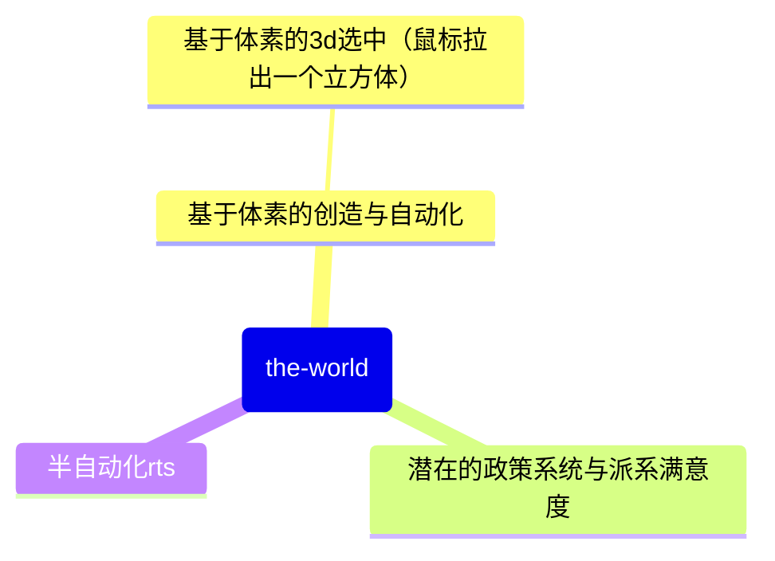
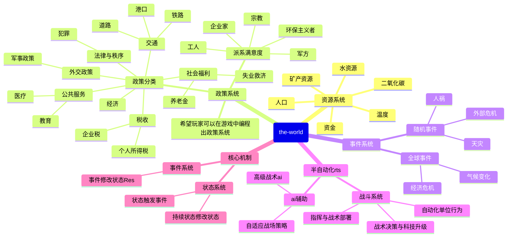
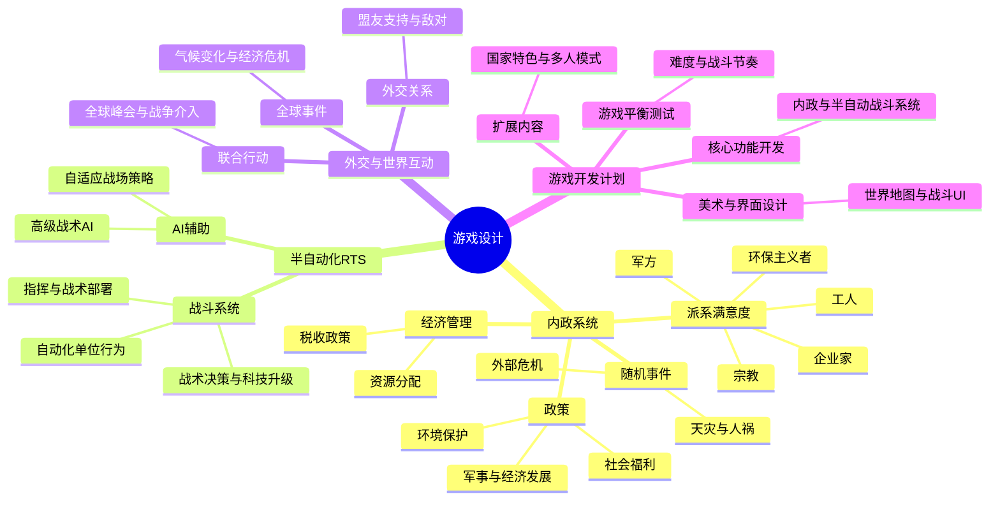

# 思维导图（暂定）

```mermaid
mindmap
root(the-world)
    基于体素的创造与自动化
        基于体素的3d选中（鼠标拉出一个立方体）
    潜在的政策系统与派系满意度
    半自动化rts
```

```mermaid
mindmap
root(the-world)
  资源系统
    人口
    资金
    矿产资源
    二氧化碳
    温度
    水资源
  政策系统
    希望玩家可以在游戏中编程出政策系统
    政策分类
      外交政策
        军事政策
      交通
        道路
        铁路
        港口
      经济
      税收
        个人所得税
        企业税
      社会福利
        养老金
        失业救济
      公共服务
        教育
        医疗
      法律与秩序
        犯罪
    派系满意度
      军方
      企业家
      工人
      宗教
      环保主义者
  事件系统
    随机事件
      天灾
      人祸
      外部危机
    全球事件
      气候变化
      经济危机
  半自动化rts
    战斗系统
      自动化单位行为
      指挥与战术部署
      战术决策与科技升级
    ai辅助
      高级战术ai
      自适应战场策略
  核心机制
    状态系统
      持续状态修改状态
      状态触发事件
    事件系统
      事件修改状态Res
```

可参考：

```mermaid
mindmap
  root((游戏设计))
    内政系统
      经济管理
        税收政策
        资源分配
      政策
        社会福利
        环境保护
        军事与经济发展
      派系满意度
        军方
        企业家
        工人
        宗教
        环保主义者
      随机事件
        天灾与人祸
        外部危机
    半自动化RTS
      战斗系统
        自动化单位行为
        指挥与战术部署
        战术决策与科技升级
      AI辅助
        高级战术AI
        自适应战场策略
    外交与世界互动
      外交关系
        盟友支持与敌对
      全球事件
        气候变化与经济危机
      联合行动
        全球峰会与战争介入
    游戏开发计划
      核心功能开发
        内政与半自动战斗系统
      游戏平衡测试
        难度与战斗节奏
      美术与界面设计
        世界地图与战斗UI
      扩展内容
        国家特色与多人模式
```
